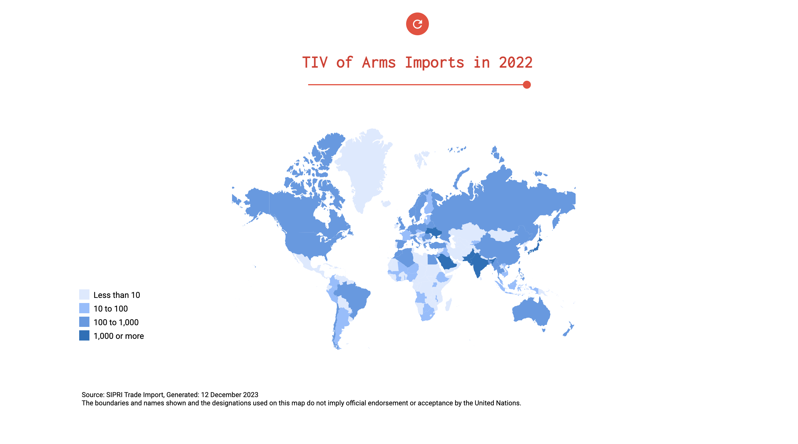
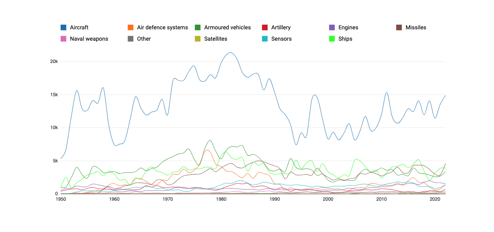
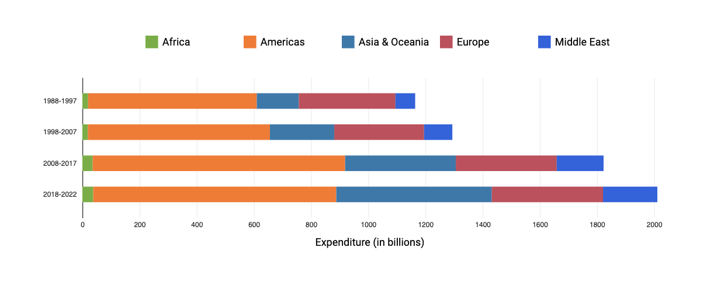
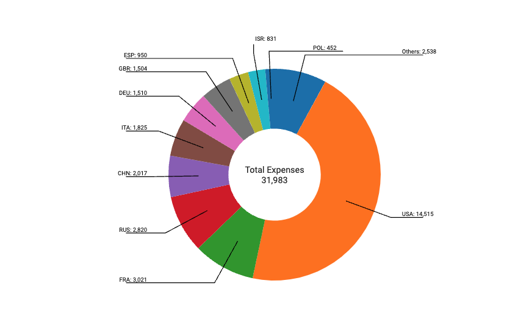
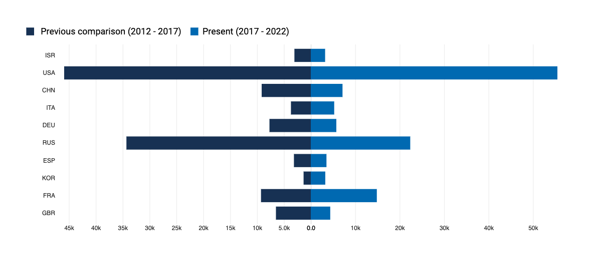

# sipri-visualization
The Stockholm International Peace Research Institute (SIPRI) is an independent organization that studies a wide range of topics related to war and peace, including arms transfers, military spending, arms control and disarmament, and peace and conflict studies. Founded in 1966, SIPRI is widely respected for its independent and impartial research, which is used by policymakers, academics, and the public around the world. SIPRI's research covers a wide range of topics, including Arms transfers, Military expenditure, Arms control, and disarmament and Peace and conflict studies . In this study we will be visualizing the first two topics through their data to understand international arms transfers and their implications for global security.

The following set of visualizations utilize arms data derived from SIPRI, group together based on the country, year and TIV values. The ensemble data depict arms under two different scenarios, "imports" and "exports" using trend-indicator values (TIVs).

For more information about the data used in this analysis, please visit the <a href="https://www.sipri.org/databases/armstransfers" target="_blank">SIPRI</a>.

